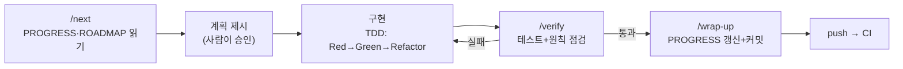

# 하네스 엔지니어링 가이드

> 이 문서 하나로 답하는 질문: **하네스가 뭔가? 이 폴더의 파일들은 각각 무슨 역할인가? 작업은 어떤 순서(사이클)로 도는가?**
> 하네스 구성이 바뀌면 이 문서도 같이 고친다 ("하네스도 코드다").

## 1. 하네스란 무엇인가

**에이전트 = 모델 + 하네스.** 모델(Claude)은 강력하지만 두 가지 근본 한계가 있다:

1. **기억이 없다** — 세션이 끝나면 대화 내용을 전부 잊는다. 다음 세션의 Claude는 어제의 Claude가 아니다.
2. **기본값이 느슨하다** — 시키는 대로 바로 코드를 쓰고, 검증 없이 "완료"를 선언하고, 구조 원칙을 세션마다 다르게 해석할 수 있다.

하네스는 이 한계를 **파일로** 보완하는 구조물이다. 모델을 갈아끼워도(버전 업그레이드 등) 하네스가 남아 있으면 프로젝트의 지식·규칙·상태는 유지된다. "그냥 해줘"라고 시키는 바이브코딩과의 차이가 바로 이것이다 — 지시가 아니라 **구조**로 품질을 강제한다.

하네스는 5가지 축으로 해부할 수 있고, 이 프로젝트에서는 각 축이 다음 파일로 구현되어 있다:

| 축 | 역할 | 이 프로젝트의 구현 |
|----|------|-------------------|
| **Context Injection** | 세션 시작 시 자동 주입되는 프로젝트 지식 | `CLAUDE.md` (+ conventions 2종 import) |
| **Control** | 작업 순서·계획·마무리를 강제하는 절차 | `.claude/commands/` (`/next` `/verify` `/wrap-up` `/gate`) |
| **Action** | 도구 실행 권한의 허용/차단 | `.claude/settings.json` |
| **Persist** | 세션을 넘나드는 상태 저장 | `docs/PROGRESS.md` · `docs/ROADMAP.md` · **git** |
| **Observe & Verify** | 완료 선언 전 검증 루프 | `/verify` 커맨드 · eval 30케이스 · CI |

## 2. 폴더 구조

```
pms_mcp/                        # 정본 경로: C:\Projects\playground\pms_mcp
├── CLAUDE.md                  # [Context] 매 세션 자동 로드되는 프로젝트 헌법
├── .claude/
│   ├── commands/              # [Control] /next /verify /wrap-up /gate
│   └── settings.json          # [Action] 권한 (팀 공유용, 개인 오버라이드는 settings.local.json)
├── .github/workflows/ci.yml   # [Verify] 하네스 밖 이중 검증 (push/PR 시 빌드·테스트)
├── docs/
│   ├── PROGRESS.md            # [Persist] 상태 원장 — 세션의 시작점이자 종착점
│   ├── ROADMAP.md             # [Persist] M-1→M3 계획 + 검증 게이트
│   ├── conventions/           # [Context] java-spring.md · react-ts.md (CLAUDE.md가 import)
│   ├── evals/eval-cases.md    # [Verify] G1 게이트용 30케이스
│   ├── reviews/               # 원천 문서 점검 기록
│   └── 하네스_가이드.md        # 이 문서
├── frontend/                   # 재사용 자산: React 프로토타입 (M1에서 재연동)
├── reference/seed/             # 재사용 자산: 시드 JSON (사원 44 · 프로젝트 382)
├── PMS_AI기능_PRD.md           # 원천 문서: 요구사항·도구 명세·수용 기준
├── PMS_MCP_구현_가이드.md      # 원천 문서: 단계별 구현 방법
└── 기술_선택_근거.md           # 원천 문서: "왜 이 기술인가"
(백엔드 코드는 M0부터 이 아래에 pms/ · ai-host/ 등으로 추가)
```

## 3. 파일별 역할 상세

### 컨텍스트 — Claude가 "알고 시작하는" 것

- **`CLAUDE.md`** — 매 세션 자동 주입되는 유일한 파일. 그래서 여기엔 "항상 참이어야 하는 것"만 담는다: 구조적 원칙 6가지(불변), 기술 스택, 명령어, 작업 방식, 필수 문서 포인터. 세부 내용은 담지 않고 "어떤 문서를 언제 읽어라"만 가리킨다 — 컨텍스트 창은 유한하므로.
- **`docs/conventions/java-spring.md` · `react-ts.md`** — 코딩 컨벤션. CLAUDE.md가 `@` import로 끌어와 함께 자동 주입된다.
- **원천 문서 3종 (PRD · 구현 가이드 · 기술 선택 근거)** — 자동 주입되지 않는다. 작업할 때 해당 섹션만 읽는다. 요구사항이 궁금하면 PRD, 구현 방법은 가이드, "왜 이 기술?"은 근거 문서. **충돌 시 원천은 이 3종이고 다른 문서가 따라간다.**

### 절차 — Claude가 "따르는 순서"

`.claude/commands/`의 md 파일 하나 = 슬래시 커맨드 하나. 채팅에 `/next`처럼 입력하면 그 파일의 지시가 실행된다.

- **`/next`** — 세션 시작. PROGRESS → ROADMAP → 관련 원천 문서 순으로 읽고, **코드 작성 전에 계획을 제시**하고 승인을 받는다.
- **`/verify`** — 작업 검증. `./gradlew test`(없으면 건너뜀) + frontend 변경 시 Vitest + MCP Inspector 검증 + "자주 틀리는 지점 6개" 점검 + diff 확인.
- **`/wrap-up`** — 세션 마무리. PROGRESS/ROADMAP 갱신 → CLAUDE.md가 틀렸으면 정정 → 커밋.
- **`/gate`** — 마일스톤 게이트 점검. eval 실행 + 체크리스트 검사 + **사람의 명시적 승인**(Claude가 스스로 통과 선언 금지) + 결정 기록.

### 권한 — Claude가 "할 수 있는" 것

- **`.claude/settings.json`** — 허용: 빌드·테스트·lint·git 조회·add/commit (매번 묻지 않도록). 차단: force push, `rm -rf`, `.env`·`application-local*` 읽기 (시크릿 보호). 개인 취향의 오버라이드는 `settings.local.json`(git 무시됨)에.

### 상태 — 세션을 넘나드는 "기억"

- **`docs/PROGRESS.md`** — **다음 세션의 Claude가 읽는 유일한 기억.** 현재 상태(마일스톤·다음 작업·차단 요소) + 결정 기록(무엇을 왜 결정했나) + 세션 로그. 모든 세션이 이 파일에서 시작하고 이 파일 갱신으로 끝난다.
- **`docs/ROADMAP.md`** — M-1→M3 체크리스트와 게이트 조건. "지금 어디까지 왔고 다음이 뭔지"의 지도. 순서를 건너뛰지 않는다.
- **git** — 롤백·추적·변경 이력. 폴더 이동·복사 시 `.git`·`.github` 같은 숨김 폴더 유실 주의 (한 번 겪었다). 리모트: `https://github.com/jeonginwoo/pms_mcp.git`

### 검증 — "완료"를 믿을 수 있게 만드는 것

- **`docs/evals/eval-cases.md`** — G1 게이트용 30케이스. 가동률·프로젝트·유지보수·쓰기 확인·권한 경계·데이터 없음·범위 밖. 치명(F1 수치 환각 · F2 권한 우회 · F3 미확인 쓰기 · F4 평가성 발언) 0건 + 합격률 ≥90%가 통과 조건. **실패를 발견할 때마다 케이스를 추가한다.**
- **`.github/workflows/ci.yml`** — push/PR마다 GitHub에서 빌드·테스트. 로컬 `/verify`와 독립된 이중 검증. gradlew·lint/test 스크립트가 생기는 대로 자동으로 검증 대상에 포함되는 가드 방식.

## 4. 사이클 진행 순서

### 세션 사이클 (매 작업, 가장 자주 도는 루프)



1. **`/next`** — Claude가 PROGRESS에서 "다음 작업"을 확인하고 계획을 제시한다. 큰 작업이면 Plan Mode(Shift+Tab 두 번)도 유용.
2. **승인** — 계획을 읽고 승인하거나 수정을 지시한다. 승인 전엔 코드를 쓰지 않는다.
3. **구현** — 테스트 먼저(TDD). 작업 단위는 ROADMAP 체크 항목 1개.
4. **`/verify`** — 통과할 때까지 완료 선언 금지. 실패하면 3으로 돌아간다.
5. **`/wrap-up`** — PROGRESS/ROADMAP 갱신 + 커밋. **대화가 길어졌으면 `/compact`보다 wrap-up 후 새 세션이 낫다** — 상태는 PROGRESS.md가 들고 있으므로 새 세션이 더 깨끗하다.

첫 세션 프롬프트 예시: `/next M-1 목업 MCP 서버부터 시작하자`

### 마일스톤 사이클 (세션 여러 개 = 마일스톤 1개)


세션 사이클을 돌려 ROADMAP 체크리스트를 채우다가, 전 항목이 완료되면 **`/gate`**를 실행한다. 게이트는 eval·테스트 결과를 표로 제시하고 **사람이 승인해야** 통과다. 승인은 PROGRESS 결정 기록에 남는다. 게이트 없이 다음 마일스톤으로 넘어가지 않는다.

### 정보 흐름 요약 — 누가 무엇을 읽고 쓰나

| 시점 | 읽기 | 쓰기 |
|------|------|------|
| 세션 시작 | CLAUDE.md(자동) → PROGRESS → ROADMAP → 원천 문서 해당 섹션 | — |
| 구현 중 | 구현 가이드 해당 Step, PRD 해당 FR | 코드 + 테스트 |
| 검증 | eval-cases(게이트 시) | — |
| 세션 끝 | — | PROGRESS(상태·로그·결정) · ROADMAP(체크) · CLAUDE.md(틀린 것 정정) · git 커밋 |

## 5. 운영 원칙 — "해줘"와 뭐가 다른가

- **작업 단위를 작게.** ROADMAP 체크 항목 1개 = 1세션이 기본. 컨텍스트 부패가 오기 전에 끝낸다.
- **검증이 게이트다.** 테스트 통과·Inspector 확인 없이는 다음 항목으로 넘어가지 않는다. 마일스톤 게이트는 사람이 승인한다.
- **하네스도 코드다.** CLAUDE.md가 현실과 어긋나면 그 자리에서 고친다. 같은 실수를 두 번 지적하게 되면 그 규칙을 CLAUDE.md에 추가한다.
- **결정은 기록한다.** 문서와 다른 결정을 하면 PROGRESS.md 결정 기록에 남긴다. 다음 세션의 Claude가 읽는 유일한 기억이다.

## 6. 하네스 유지보수 — 언제 무엇을 고치나

| 상황 | 고칠 곳 |
|------|---------|
| 명령어·구조가 바뀌어 CLAUDE.md가 현실과 다름 | CLAUDE.md 즉시 (wrap-up이 점검) |
| 같은 실수를 Claude에게 두 번 지적함 | CLAUDE.md 또는 conventions에 규칙 추가 |
| 문서와 다른 설계 결정을 내림 | PROGRESS.md 결정 기록 |
| eval에서(또는 실사용에서) 새 실패 유형 발견 | eval-cases.md에 케이스 추가 |
| 권한 프롬프트가 반복적으로 뜸 | settings.json allow에 추가 (위험한 건 제외) |
| 반복 절차가 생김 | .claude/commands/에 커맨드 추가 |
| 위 어떤 것이든 하네스 구성이 바뀜 | 이 문서의 구조도·표 갱신 |
