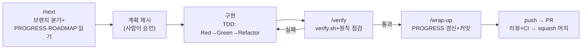

# 하네스 엔지니어링 가이드

> 이 문서 하나로 답하는 질문: **하네스가 뭔가? 이 폴더의 파일들은 각각 무슨 역할인가? 작업은 어떤 순서(사이클)로 도는가?**
> 하네스 구성이 바뀌면 이 문서도 같이 고친다 ("하네스도 코드다").
> 참고: 하네스 **지시 파일**(CLAUDE.md·commands·agents·skills·scripts)은 영어 메인이다(2026-07-18 전환 — LLM 지시문은 영어가 더 안정적). 이 문서는 사람용 온보딩 문서라 한국어를 유지한다.

## 1. 하네스란 무엇인가

**에이전트 = 모델 + 하네스.** 모델(Claude)은 강력하지만 세 가지 근본 한계가 있다:

1. **기억이 없다 (무상태성)** — 세션이 끝나면 대화 내용을 전부 잊는다. 다음 세션의 Claude는 어제의 Claude가 아니다.
2. **컨텍스트가 유한하고 부패한다** — 긴 세션에서는 초반 지시를 잊고, 실패 잔해·방대한 로그가 판단을 흐린다 (context rot).
3. **검증 없는 자신감** — 컴파일이 안 되는 코드도 "완료했습니다"라고 보고할 수 있고, 압박하면 테스트를 약화시켜 통과하는 반칙(reward hacking)도 저지른다.

하네스는 이 한계를 프롬프트("잘 해줘")가 아니라 **모델 밖의 구조물** — 파일, 스크립트, 훅, 권한, 테스트, 역할 분리 — 로 보완한다. 모델을 갈아끼워도 하네스가 남아 있으면 프로젝트의 지식·규칙·상태는 유지된다. "그냥 해줘" 바이브코딩과의 차이가 바로 이것이다 — 지시가 아니라 **구조**로 품질을 강제한다.

하네스는 5가지 축으로 해부할 수 있고, 이 프로젝트에서는 각 축이 다음 파일로 구현되어 있다:

| 축 | 역할 | 이 프로젝트의 구현 |
|----|------|-------------------|
| **Context Injection** | 세션 시작 시 자동 주입되는 지식 + 필요할 때만 로드되는 지식 | `CLAUDE.md` (+ conventions 3종 import) · `.claude/skills/` 2종(점진적 공개) |
| **Control** | 작업 순서·계획·마무리를 강제하는 절차 | `.claude/commands/` 6종 · `scripts/ralph.sh`(자율 루프) |
| **Action** | 도구 실행 권한의 허용/차단 + 이벤트 강제 | `.claude/settings.json` 권한 · **Stop 훅**(컴파일 깨진 채 세션 종료 차단) |
| **Persist** | 세션을 넘나드는 상태 저장 | `docs/PROGRESS.md`(상태·결정·작업 큐) · `docs/ROADMAP.md` · **git (GitHub Flow)** |
| **Observe & Verify** | 완료 선언 전 검증 루프 + 역할 분리 | `scripts/verify.sh` · `/verify` · `.claude/agents/` 3종 · eval 30케이스 · CI + main 보호 ruleset |

축들은 서로의 전제 조건이다: 외부 메모리(Persist)가 있어야 새 세션이 이어받을 수 있고, 검증 게이트(Verify)가 있어야 루프가 쓰레기를 쌓지 않으며, 훅·권한(Action)이 있어야 검증을 우회하지 못한다.

## 2. 폴더 구조

```
pms_mcp/                        # 정본 경로: C:\Projects\pms_mcp
├── CLAUDE.md                  # [Context] 매 세션 자동 로드되는 프로젝트 헌법 (영어) + 교훈 섹션
├── .claude/
│   ├── commands/              # [Control] /next /verify /wrap-up /gate /sync-docs
│   ├── agents/                # [Verify] architect · boundary-reviewer · verifier (역할 분리)
│   ├── skills/                # [Context] mcp-tool · module-scaffold (해당 작업 때만 로드)
│   └── settings.json          # [Action] 권한 + Stop 훅 등록 (개인 오버라이드는 settings.local.json)
├── .github/workflows/ci.yml   # [Verify] 하네스 밖 이중 검증 (push/PR 시 빌드·테스트)
├── scripts/
│   ├── verify.sh              # [Verify] 전체 검증 — 로그를 build/last-verify.log로 오프로딩
│   ├── ralph.sh               # [Control] 신선한 컨텍스트 루프 — 작업 큐 자율 처리
│   └── hooks/stop-verify.sh   # [Action] Stop 훅 본체 — Java 변경+컴파일 실패면 종료 차단
├── docs/
│   ├── PROGRESS.md            # [Persist] 상태 원장 — 세션의 시작점이자 종착점 + 작업 큐
│   ├── ROADMAP.md             # [Persist] M-1→M3 계획 + 검증 게이트
│   ├── conventions/           # [Context] java-spring · react-ts · git-workflow (CLAUDE.md가 import)
│   ├── evals/eval-cases.md    # [Verify] G1 게이트용 30케이스
│   ├── reviews/               # 원천 문서 점검 기록
│   └── 하네스_가이드.md        # 이 문서
├── frontend/                   # 재사용 자산: React 프로토타입 (M1에서 재연동)
├── reference/seed/             # 재사용 자산: 시드 JSON (사원 44 · 프로젝트 382)
├── PMS_AI기능_PRD.md           # 원천 문서: 요구사항·도구 명세·수용 기준
├── PMS_MCP_구현_가이드.md      # 원천 문서: 단계별 구현 방법
└── 기술_선택_근거.md           # 원천 문서: "왜 이 기술인가"
(백엔드 코드는 M0부터 이 아래에 pms/ · ai-host/ 등으로 추가 — verify.sh가 자동 탐색)
```

## 3. 파일별 역할 상세

### 컨텍스트 — Claude가 "알고 시작하는" 것

- **`CLAUDE.md`** — 매 세션 자동 주입. "항상 참이어야 하는 것"만 담는다: 구조적 원칙 6가지(불변), 기술 스택, 명령어, 작업 방식, 필수 문서 포인터, **교훈(Lessons Learned) 섹션**(반복 실수를 한 줄씩 축적 — 에이전트의 실수가 하네스 개선으로 쌓이는 자기개선 루프). 세부 내용은 담지 않고 "어떤 문서를 언제 읽어라"만 가리킨다 — 컨텍스트 창은 유한하므로.
- **`docs/conventions/`** — `java-spring.md`(코딩 컨벤션·TDD) · `react-ts.md`(프론트) · `git-workflow.md`(브랜치 전략). CLAUDE.md가 `@` import로 끌어와 함께 자동 주입된다.
- **`.claude/skills/`** — **점진적 공개**: 항상 필요하지 않은 상세 지식은 스킬로 분리해 두고, 해당 작업이 감지될 때만 본문이 로드된다. `mcp-tool`(도구 추가·수정 체크리스트 — 2단계 confirmed 쓰기, four-in-one, 닫힌 카탈로그), `module-scaffold`(Modulith 모듈 골격과 규칙 8가지). CLAUDE.md 비대화를 막는 장치.
- **원천 문서 3종 (PRD · 구현 가이드 · 기술 선택 근거)** — 자동 주입되지 않는다. 작업할 때 해당 섹션만 읽는다. **충돌 시 원천은 이 3종이고 다른 문서가 따라간다.** 결정이 바뀌면 `/sync-docs`로 CLAUDE.md부터 갱신한다(문서 drift 관리).
- **언어 정책** — 지시 파일(프롬프트)은 영어, 기록물(PROGRESS·ROADMAP·원천 문서·이 가이드)은 한국어. 한국어 리터럴(MCP 에러 메시지 문구, 확인 카드 라벨, "주석은 한국어" 규칙)은 영어 문서 안에서도 보존한다.

### 절차 — Claude가 "따르는 순서"

`.claude/commands/`의 md 파일 하나 = 슬래시 커맨드 하나.

- **`/next`** — 세션 시작. **브랜치 확인(코드 작업이면 main에서 분기)** → PROGRESS → ROADMAP → 관련 원천 문서 순으로 읽고, **코드 작성 전에 계획을 제시**하고 승인을 받는다. 두 모듈 이상에 걸치면 `architect` 에이전트 먼저. `--loop` 모드(ralph.sh 전용)에서는 승인 없이 작업 큐 1개 항목만 완주하고 STOP.
- **`/verify`** — 작업 검증. `bash scripts/verify.sh` + FR-AI-04 컴포넌트 테스트 확인 + MCP Inspector 검증 + four-in-one 리마인드 + "자주 틀리는 지점 6개" 점검 + diff 확인.
- **`/wrap-up`** — 세션 마무리. PROGRESS/ROADMAP 갱신 → CLAUDE.md 정정·교훈 추가 → 커밋 → **브랜치 처리(push + PR 제안)**.
- **`/gate`** — 마일스톤 게이트 점검. eval 실행 + 체크리스트 검사 + **사람의 명시적 승인**(Claude가 스스로 통과 선언 금지) + 결정 기록.
- **`/sync-docs`** — 설계·컨벤션 결정 변경 시 문서 동기화. CLAUDE.md(운영 문서)부터 갱신, four-in-one 점검 포함.
- **`scripts/ralph.sh`** — **신선한 컨텍스트 루프**: PROGRESS의 작업 큐(`- [ ]`)를 반복당 새 세션(`claude -p "/next --loop"`)으로 하나씩 소화하고, 반복 사이에 `verify.sh --quick`으로 회귀를 차단한다. 긴 세션의 컨텍스트 부패를 피하는 방식 — 단, **외부 메모리(작업 큐)가 완비됐을 때만** 유효하다. 가드: main에서 실행 거부, 최대 반복 수(기본 3), 실패 시 즉시 중단. **사람이 로그를 지켜볼 때만 돌린다.**

### 권한과 훅 — Claude가 "할 수 있는" 것 (결정론적 강제)

프롬프트 지시는 확률적이지만(대체로 따르나 가끔 어긴다) 훅·권한은 결정론적이다. **"절대 어기면 안 되는 규칙"은 문서가 아니라 훅·권한·테스트로 강제한다.**

- **`.claude/settings.json` 권한** — allow(속도): 빌드·테스트·lint·`bash scripts/*`·git 조회·add/commit·branch/switch — 매번 묻지 않도록. deny(안전): force push, `rm -rf`(비가역), `.env*`·`*.pem`·`application-local*` 읽기(기밀 — 컨텍스트에 들어간 시크릿은 유출될 수 있으므로 읽기 자체를 차단).
- **Stop 훅 (`scripts/hooks/stop-verify.sh`)** — 세션 종료 시점에 실행. Java 변경이 있는데 컴파일이 깨져 있으면 exit 2로 **종료 자체를 차단**하고, 오류 로그를 모델에게 돌려줘 스스로 고치게 한다(차단 + 피드백). gradlew가 아직 없으면 조용히 통과 — 하네스는 프로젝트의 모든 성장 단계에서 동작해야 한다.

### 역할 분리 — 판정이 오염되지 않게

`.claude/agents/`의 서브에이전트는 **별도 컨텍스트 + 제한된 도구(Read/Grep/Glob/Bash — 수정 권한 없음)**를 가진다. 작성자가 자기 코드를 판정하는 이해충돌을 권한으로 차단하고, 대량 탐색의 잔해가 메인 컨텍스트를 오염시키지 않게 한다(결론 요약만 돌아온다).

- **`architect`** — 설계만. 두 모듈 이상 걸치는 기능·애그리거트·MCP 도구 추가 전에 사용. 산출물은 작업 큐에 붙일 작업 목록.
- **`boundary-reviewer`** — diff를 CLAUDE.md·컨벤션과 대조해 BLOCKER/MAJOR/MINOR로 판정만 (APPROVE / NEEDS CHANGES). PR 설명에 판정을 첨부해 상대방 리뷰 부담을 줄인다.
- **`verifier`** — verify.sh 실행과 실패 진단만. **"Modulith 실패 시 테스트를 약화시키지 말고 의존 방향을 고쳐라"가 명시**되어 있다(반칙 경로 차단).

### 상태 — 세션을 넘나드는 "기억"

- **`docs/PROGRESS.md`** — **다음 세션의 Claude가 읽는 유일한 기억.** 현재 상태(마일스톤·다음 작업·차단 요소) + 결정 기록(무엇을 왜) + **작업 큐(Ralph 루프용 — 계획이 합의된 커밋 단위 작업만)** + 세션 로그. 모든 세션이 이 파일에서 시작하고 이 파일 갱신으로 끝난다. 2인 협업이므로 충돌 시 세션 로그는 둘 다 보존, 현재 상태는 최신이 이긴다.
- **`docs/ROADMAP.md`** — M-1→M3 체크리스트와 게이트 조건. 순서를 건너뛰지 않는다.
- **git (GitHub Flow, 2인 협업)** — 규칙은 `docs/conventions/git-workflow.md`: main은 항상 그린, 1 작업 = 1 브랜치(`feat/m1-...`) = 1 PR, **squash 머지**(main에 1 작업 = 1 커밋), 분담 단위는 Modulith 모듈(같은 모듈 internal을 동시에 안 만짐). Claude는 main에서 코드 작업 금지. 리모트: `https://github.com/jeonginwoo/pms_mcp.git` — main 보호 ruleset 활성(PR 필수, 필수 체크 `backend`·`frontend`, squash만 허용, force push 차단). ※ "docs/chore는 main 직접 커밋 허용" 예외와 ruleset의 PR 필수가 충돌 — 해소 전까지는 문서 변경도 PR 경유 (PROGRESS 미해결 이슈).

### 검증 — "완료"를 믿을 수 있게 만드는 것

검증은 속도-엄밀함 트레이드오프에 따라 계층화되어 있다. **빠른 검증은 자주, 무거운 검증은 게이트에서.**

| 계층 | 도구 | 속도 | 검증 대상 |
|------|------|------|-----------|
| L1 컴파일 | `verify.sh --quick` (Stop 훅·ralph 반복이 사용) | 초 | 문법·타입 |
| L2 단위 | 순수 도메인 테스트 | 초 | 도메인 불변식 |
| L3 통합 | Testcontainers + 실제 PostgreSQL (**H2 금지**) | 분 | 영속성·트랜잭션·409 |
| L4 아키텍처 | Modulith/ArchUnit 경계 테스트 | 초 | 모듈 경계·의존 방향 |
| L5 AI 행동 | eval 30케이스 (게이트 G1/G2) | 분 | 환각·권한 누출·미확인 쓰기 |

- **`scripts/verify.sh`** — L1~L4를 한 번에. Gradle 앱을 자동 탐색(초기화 전이면 skip)하고, **전체 로그를 `build/last-verify.log`로 오프로딩**한다 — 수천 줄 Gradle 로그가 컨텍스트를 점령하지 않도록. 실패 시 필요한 부분만 grep/tail로 읽는다.
- **`docs/evals/eval-cases.md`** — L5. 치명(F1 수치 환각 · F2 권한 우회 · F3 미확인 쓰기 · F4 평가성 발언) 0건 + 합격률 ≥90%가 통과 조건. 도구명·도구 설명·시스템 프롬프트·eval셋은 **four-in-one** — 하나가 바뀌면 넷을 함께 갱신하고 전체 재실행. **실패를 발견할 때마다 케이스를 추가한다.**
- **`.github/workflows/ci.yml`** — push/PR마다 GitHub에서 빌드·테스트. 로컬 `/verify`와 독립된 이중 검증이자 main 보호 ruleset의 필수 체크. gradlew·lint/test 스크립트가 생기는 대로 자동 포함되는 가드 방식.

## 4. 사이클 진행 순서

### 세션 사이클 (매 작업, 가장 자주 도는 루프)



1. **`/next`** — 브랜치 확인(코드 작업이면 main에서 분기), PROGRESS에서 "다음 작업"을 확인하고 계획을 제시한다. 큰 작업이면 Plan Mode(Shift+Tab 두 번)도 유용.
2. **승인** — 계획을 읽고 승인하거나 수정을 지시한다. 승인 전엔 코드를 쓰지 않는다.
3. **구현** — 테스트 먼저(TDD). 작업 단위는 ROADMAP 체크 항목 1개.
4. **`/verify`** — 통과할 때까지 완료 선언 금지. 실패하면 3으로 돌아간다. (Stop 훅이 배후에서 한 번 더 지킨다 — 컴파일 깨진 채로는 세션이 안 끝난다.)
5. **`/wrap-up`** — PROGRESS/ROADMAP 갱신 + 커밋 + push/PR. **대화가 길어졌으면 `/compact`보다 wrap-up 후 새 세션이 낫다** — 상태는 PROGRESS.md가 들고 있으므로 새 세션이 더 깨끗하다.
6. **PR 머지** — 상대방 리뷰 승인 + CI green → squash 머지 → 브랜치 삭제.

첫 세션 프롬프트 예시: `/next M-1 목업 MCP 서버부터 시작하자`

### Ralph 루프 (자율 모드 — 선택적)

계획이 이미 합의된 기계적 작업 여러 개를 밀어낼 때: 작업을 커밋 단위로 쪼개 PROGRESS 작업 큐에 `- [ ]`로 넣고, 작업 브랜치에서 `bash scripts/ralph.sh 3`. 반복마다 **새 세션**이 큐에서 1개를 집어 구현→검증→커밋→STOP 하고, 반복 사이에 quick 검증이 회귀를 차단한다. 자율성은 0/1이 아니라 다이얼이다 — 기본은 사람 승인 루프(위 세션 사이클)이고, ralph는 사람이 로그를 지켜보며 명시적으로 감쌀 때만.

### 마일스톤 사이클 (세션 여러 개 = 마일스톤 1개)


세션 사이클을 돌려 ROADMAP 체크리스트를 채우다가, 전 항목이 완료되면 **`/gate`**를 실행한다. 게이트는 eval·테스트 결과를 표로 제시하고 **사람이 승인해야** 통과다. 승인은 PROGRESS 결정 기록에 남는다. 게이트 없이 다음 마일스톤으로 넘어가지 않는다.

### 정보 흐름 요약 — 누가 무엇을 읽고 쓰나

| 시점 | 읽기 | 쓰기 |
|------|------|------|
| 세션 시작 | CLAUDE.md+conventions(자동) → PROGRESS → ROADMAP → 원천 문서 해당 섹션 (+해당 작업이면 스킬 자동 로드) | 작업 브랜치 생성 |
| 구현 중 | 구현 가이드 해당 Step, PRD 해당 FR | 코드 + 테스트 |
| 검증 | build/last-verify.log(실패 부분만), eval-cases(게이트 시) | — |
| 세션 끝 | — | PROGRESS(상태·로그·결정·작업 큐) · ROADMAP(체크) · CLAUDE.md(정정·교훈) · git 커밋 → PR |

## 5. 운영 원칙 — "해줘"와 뭐가 다른가

- **작업 단위를 작게.** ROADMAP 체크 항목 1개 = 1세션이 기본. 컨텍스트 부패가 오기 전에 끝낸다. 긴 세션보다 **새 세션 + 파일 복원**이 낫다 (외부 메모리가 전제).
- **검증이 게이트다.** 테스트 통과·Inspector 확인 없이는 다음 항목으로 넘어가지 않는다. 마일스톤 게이트는 사람이 승인한다. H2 같은 가짜 환경의 그린라이트는 무검증보다 위험하다.
- **규칙의 강제 수단을 중요도에 맞춘다.** 절대 규칙 = 테스트(Modulith)·훅(Stop)·권한(deny), 일반 규칙 = 문서. 검증 가능한 규칙은 검증 코드로 승격시킨다.
- **반칙 경로는 미리 봉쇄한다.** 테스트 약화 금지(verifier에 명시), 판정자의 수정 권한 제거(agents), 닫힌 도구 카탈로그, 2단계 confirmed 쓰기, 작업 큐의 "발견 일감은 추가만"(scope creep 차단).
- **하네스도 코드다.** CLAUDE.md가 현실과 어긋나면 그 자리에서 고친다. 같은 실수를 두 번 지적하게 되면 교훈 섹션 또는 conventions에 규칙을 추가한다.
- **결정은 이유와 함께 기록한다.** 문서와 다른 결정을 하면 PROGRESS.md 결정 기록에 남긴다. 판단 기준을 상속시키면 목록 밖 상황에서도 올바르게 판단한다.

## 6. 하네스 유지보수 — 언제 무엇을 고치나

| 상황 | 고칠 곳 |
|------|---------|
| 명령어·구조가 바뀌어 CLAUDE.md가 현실과 다름 | CLAUDE.md 즉시 (wrap-up이 점검) |
| 같은 실수를 Claude에게 두 번 지적함 | CLAUDE.md 교훈 섹션 또는 conventions에 규칙 추가 |
| 설계·컨벤션 결정이 바뀜 | `/sync-docs` — CLAUDE.md부터, PROGRESS 결정 기록까지 |
| 특정 작업에만 필요한 상세 지식이 CLAUDE.md를 비대하게 함 | `.claude/skills/`로 분리 (트리거를 description에 명확히) |
| eval에서(또는 실사용에서) 새 실패 유형 발견 | eval-cases.md에 케이스 추가 |
| MCP 도구·설명·시스템 프롬프트 변경 | four-in-one — 넷 함께 갱신 + 전체 eval 재실행 |
| 권한 프롬프트가 반복적으로 뜸 | settings.json allow에 추가 (비가역·기밀은 제외) |
| "절대 어기면 안 되는" 새 규칙이 생김 | 문서가 아니라 훅·권한·테스트로 (scripts/hooks/, settings.json) |
| 반복 절차가 생김 | .claude/commands/에 커맨드 추가 |
| 위 어떤 것이든 하네스 구성이 바뀜 | 이 문서의 구조도·표 갱신 (지시 파일은 영어로 작성) |
