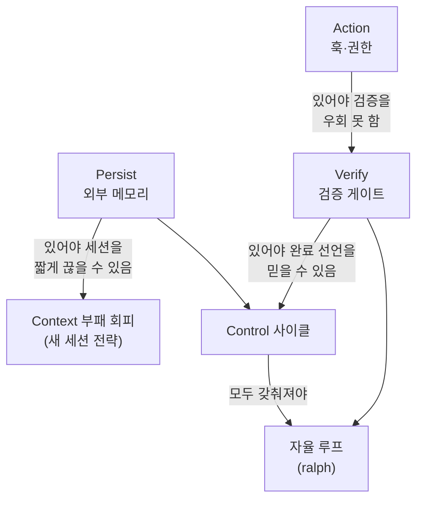

```mermaid
flowchart TD
    P["Persist<br>외부 메모리"] -->|"있어야 세션을<br>짧게 끊을 수 있음"| C2["Context 부패 회피<br>(새 세션 전략)"]
    V["Verify<br>검증 게이트"] -->|"있어야 완료 선언을<br>믿을 수 있음"| CT["Control 사이클"]
    A["Action<br>훅·권한"] -->|"있어야 검증을<br>우회 못 함"| V
    P --> CT
    CT -->|"모두 갖춰져야"| R["자율 루프<br>(ralph)"]
    V --> R
```